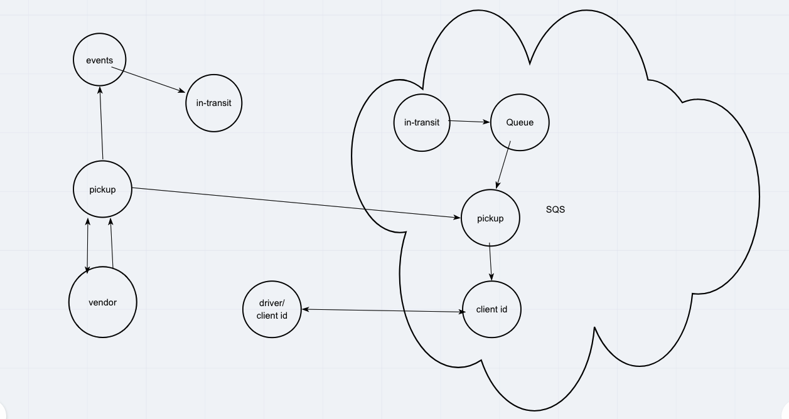

# Lab-19 Caps-Cloud

## Author: Jason Quaglia

- [link to github PR](https://github.com/jquaglia/caps-cloud/pull/1)

- [SQS DOCS](https://docs.aws.amazon.com/AWSSimpleQueueService/latest/APIReference/API_ReceiveMessage.html)

- [AWS SDK SQS DOCS](https://docs.aws.amazon.com/AWSJavaScriptSDK/latest/AWS/SQS.html)

- [SNS DOCS](https://docs.aws.amazon.com/sns/latest/api/API_Publish.html)

## Getting Started

- Clone the repository
- ```npm init -y``` in each subfolder (acme, flowers, and driver)
- ```npm install``` in each subfolder (acme,flowers, and driver)
- Open terminal windows for each subfolder and run the corresponding commands:
  - In acme: ```node pickup.js```
  - In flowers: ```node pickup.js```
  - In driver: ```node driver.js```
  - In acme: ```node vendor.js```
  - In flowers: ```node vendor.js```

## Feature Task

- A real-time service that allows for vendors, such as flower shops or restaurants, to alert a system of a package needing to be delivered, for drivers to instantly see what’s in their pickup queue, and then to alert the vendors as to the state of the deliveries (in transit, and then delivered) using AWS serverless service.

### __Required Services__

1. SNS Topic: __pickup__ which will receive all pickup requests from vendors

1. SQS Queue (FIFO): __packages__ which will contain all delivery requests from vendors, in order of receipt.

    - Subscribe this queue to the __pickup__ topic so all pickups are ordered all delivery notifications from the drivers

### __Operations__

__Vendors:__

- Vendors will post “pickup” messages containing delivery information into the SNS pickup topic

  - `{ orderId: 1234, customer: "Jane Doe", vendorId: queueArn}`
  
  - Note the `queueArn` – this refers to the AWS ‘arn’ of the vendor’s specific delivered queue
  
- Pickup requests should be moved into a FIFO queue for the drivers automatically

- Vendors should separately subscribe to their personal SQS queue and periodically poll the queue to see delivery notifications

__Drivers:__

- Drivers will poll the SQS __packages__ queue and retrieve the next delivery order (message)

- After a time (e.g. 5 seconds), drivers will post a message to the Vendor specific SQS Queue using the `queueArn` specified in the order object

## Colaborators

- Carly Dekock

- Jason Quaglia

- Jason Dormier

- Nick Macgruder

- Bill Moreno

## UML


